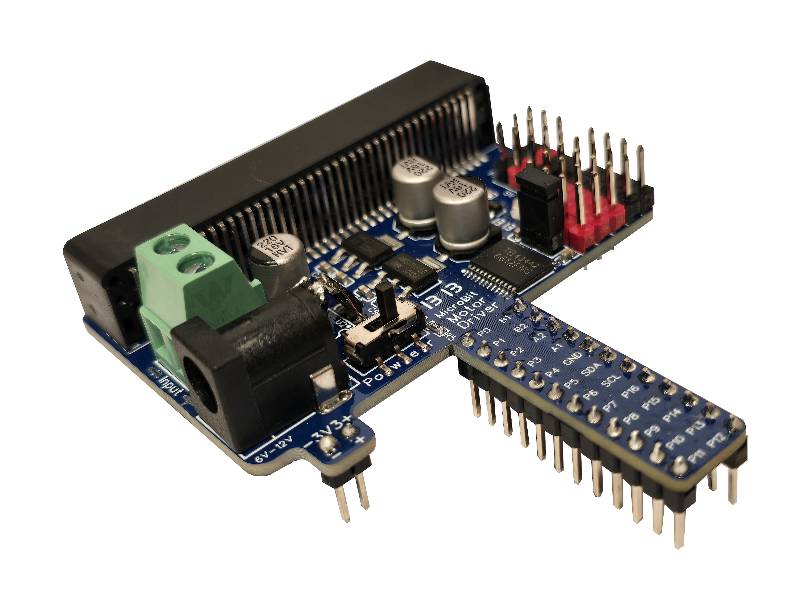
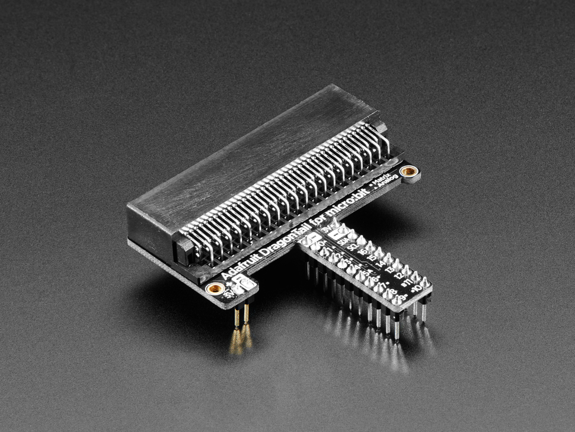
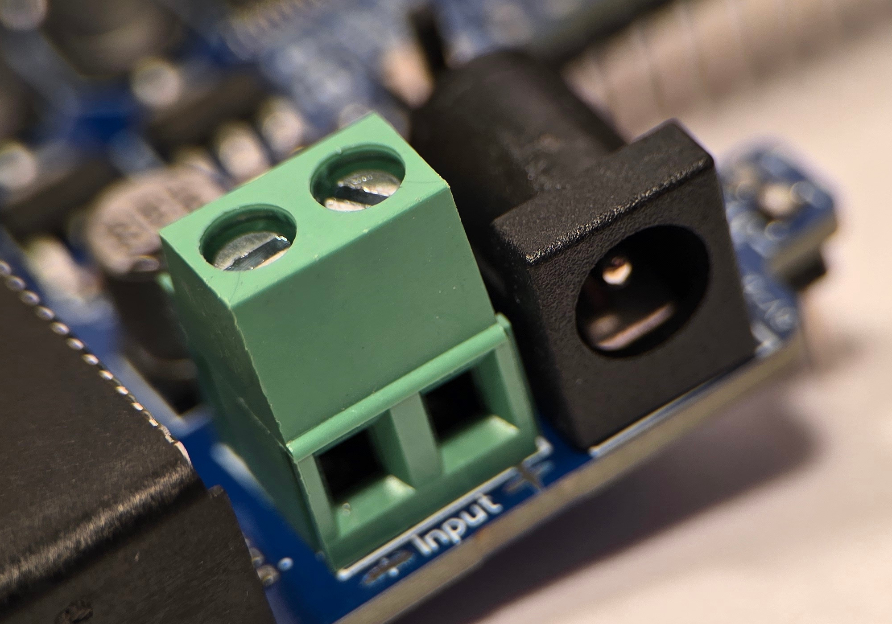
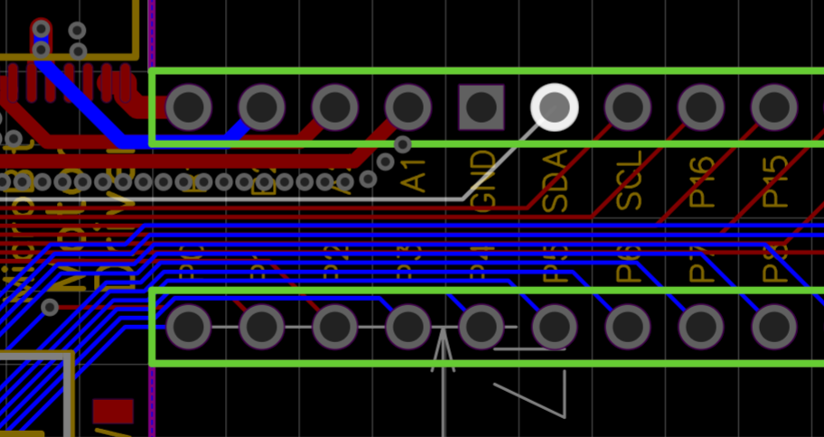
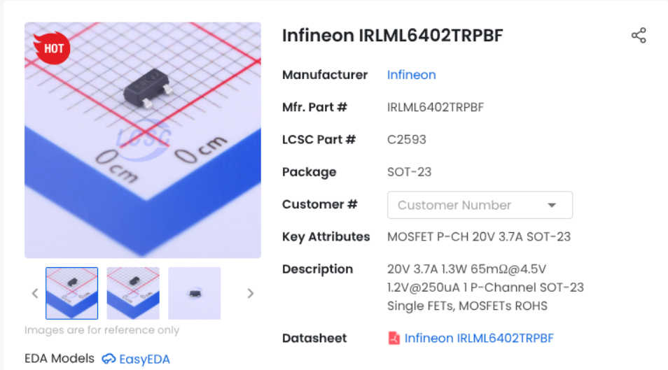

# pxt-MotorTail

BoredBuilder

# MotorTail Documentation
## Intro
* Introduction
* Inspiration
* Simple Usecase
* Inputs
## Programming
* MakeCode Commands
* Driving DC Motor
* Driving Stepper Motor
* Driving Servo Motor
## Design Desicions
* PCB Design
* RPP (Reverse Polarity Protection)
* How RPP
* Feedback

## Introduction
This add-on board splits out the connctions on the microbit card to a breadboard interface and adds a dual H-Bridge function to control two DC motors or one bipolar stepper motor. Additionally, everything can be powered by a single 6-12V source. The source can even be connected backwards since the input powerside has RPP (reverse polarity protection). This feature is discussed on [(Desing Conciderations)](Design.md##Reverse Polarity Protection) for futher clarity.

## Inspritation
The [DragonTail](https://www.adafruit.com/product/3695) (Purchace Link) aspect was taken from adafruit's purely GPIO implemtation. I thought this was a better way to make the gpio pins more accesable than the unique card interface that the microbit uses so I implemented it. Along with exposing the GPIO's though and easy to use bread board interface it also has a side connector for a bread board's power rails perfect for addional boards like Oleds, gyros, etc... That is just an example as the microbit already has an gyro but I digress.

## Simple Usecase
Here is one of the simple robots that you can make. It uses popcikle sticks as the frame. In order to tie the front end together I 3d modeled a faceplate to hold it all together and added a sliding feature so it can glide across smooth surfaces. In hindsight this siding feature is a little too sharp and doesn't allow for movement accross carpet or other rough surfaces. A ball like many other robots use is far better. 

## Inputs
The MotorTail has both a DC barrel jack and a screw terminal for accecible power input. The 6-12V pins oposite to the input side should not be used for power input as they are on the already filtered side of the reverse polarity protection and power switch. These pins are only used to power accesories and it was just convient to put them close to the motor driver within the PCB design.
# MakeCode Commands

## Driving DC Motor

## Driving Stepper Motor

## Driving Servo Motors

# Design Desicions
## PCB Design
The current version is a two layer copper FR4 but this is highly undesireable because of the noise interference the tail experices with protocals like I2C or SPI. Two layers were chosen because it was cost effective but
in the future we will concider 4 as it minimizes lots of undesireable power and signal noise not to mention better power delivery.

Here are the noisy traces that cause issues and can be quickly fixed. In retrospect we should have ate the cost for the peace of mind but we were still using easyeda std at that point and we didn't know how to add more layers for power and GND.

## Reverse Polarity Protection (RPP)
### Why?
It is easy to forget whether you wired up your battery or connected your power supply in the right orentation. In order to add more protection to the design we decided to do a little bit of reseach into efficient solutions for reverse polarity protection and switching. After concidering our my options we settled on something we found on an obscure EEE form that we no longer can find. We did some more testing on this specific circuit and concidered it suppirior to premade IC's with fancy unnecesary features, at least for our needs. The cost of these are upwards of $1 per chip while a couple of P-Channel mosfets and resistors cost less than 12 cents! Not to mention these descrete MOSFETs allow for more current to pass. 

We used [LCSC](lcsc.com) for most of pur component orders because they have a great catalog of componets and prices. They are located in China so it takes some time to ship to the US but it is well worth it. 

### How?
This RRP (Reverse Polarity Protection) works by two source tied P-Channel MOSFETs in series. We set up a Falstad representation of the circuit used. You can download and test/manipulate it here, you can also watch the video we did on it here. In basic pricipals it uses the correct bias of the MOSFETs or Vgs Voltage between gate and source to turn it on when conditions permit. Since we have control over the gates we can direct the power from them when we want to stop powering the system from the power source.

## Feedback 
Please create issues or leave comments in the places that we have posted the design so we can improve it for the future.